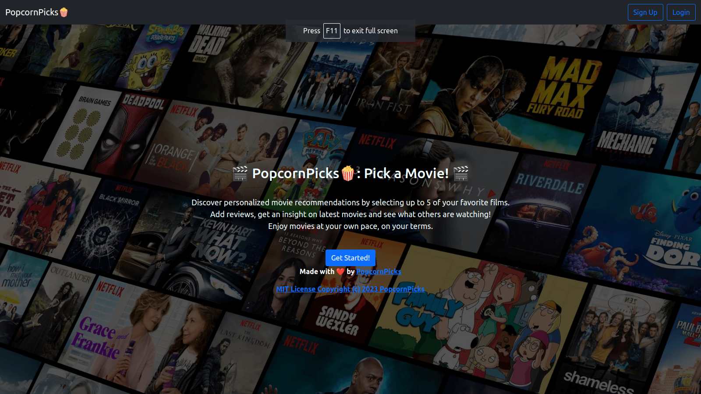
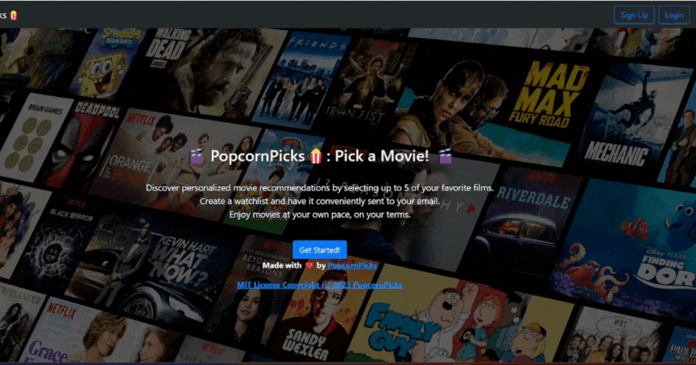
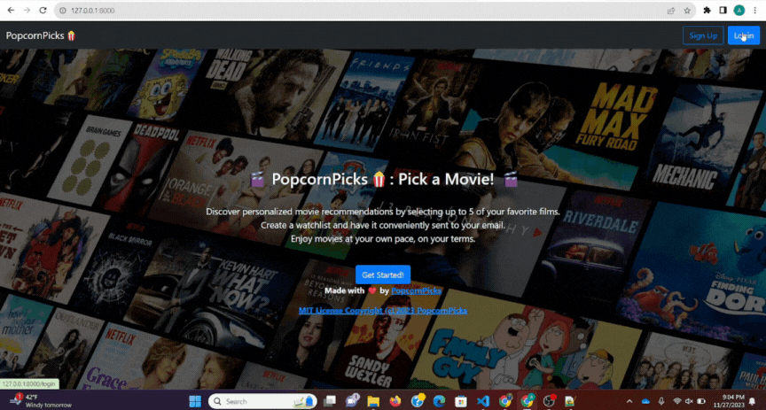

# <i> PopcornPicks🍿: Your Destination for Movie Recommendations </i>

# [Check our Wiki Page for detailed information about the project, system architecture, installation steps, guides and a lot more!](https://github.com/tanmaypardeshi/CSC-510-Project3-PopcornPicks/wiki)

              

<b>PopcornPicks is more than just a movie recommender system; it's a gateway to a world of cinematic adventures. With an ever-expanding library of films, a powerful recommendation algorithm, an all-new chat room, a new state-of-the-art account system, a newly added robust review system, and more, PopcornPicks is here to transform the way you discover, enjoy, and connect with movies.</b>

# Contents

- [Why use PopcornPicks?](#why-use-popcornpicks)
- [Project Documentation](#documentation)
- [Project Presentation Video](#project-presentation-video)
- [Brief Overview of Project](#project-description)
- [Core Applications of the Project](#core-applications-of-the-project) 
  - [Recommendation Mechanism](#movie-recommendation-mechanism) 
  - [Email Notifier](#email-notifier)
- [Improvements Made in the Project](#project-2-delta)
- [TechStack Used for the Development of Project](#tech-stack-used)
- [Steps for Execution](#getting-started)
- [Future Scope](#future-scope)
- [Contribute](#contribute-to-the-project)
- [Team Members](#contributors)
- [Contact](#contact)
- [License](#license)

## Why use PopcornPicks?

**PopcornPicks: Your personalized movie guide!**

- **Efficient:** Lightning-fast recommendations for movie buffs! 🚀
- **Adaptable:** Tailor the recommendations to your taste.
- **Accessible:** Works across all platforms and shells.
- **Insightful:** Get movie insights at a glance.
- **Comprehensive:** Includes the ability to review and chat about your favorite movies.
- **Simple:** Easy installation and setup – start discovering great movies in no time!
- **Robust:** Build your own account where you can store all the movies you've seen.
 

## Documentation

Checkout for project documentation at our [wiki page](https://github.com/tanmaypardeshi/PopcornPicks/wiki)

## Project Presentation Video

You can see the project presentation at - https://youtu.be/ymAo_zXfZ0c

## Project Description

PopcornPicks is a user-friendly movie recommender that curates a tailored list of 10 movie predictions based on user-provided movie preferences. Users can input their favorite movies, and our algorithm refines recommendations based on feedback—Liked, Disliked, or Yet To Watch. Additionally, users can write reviews, save them, check out the latest movies out there and also check out the buzz going on about movies by viewing what others are writing for their reviews. For the system architecture and other details, please refer to our [wiki page](https://github.com/tanmaypardeshi/PopcornPicks/wiki)

## Core Applications of the Project

### Engaging and Interactive UI

### User Authentication

#### Sign up: Users can register to PopcornPicks to get the best recommendations for their favourite movies and genres

#### Login: 

### Personalised Profile Page for Users

### Check Out New and Upcoming Movies

### Movie Recommendation Mechanism

### Write Movie Reviews

### See What Others Have Seen 

### Chat Room

## Project 3 - New Version

Check out the significant changes that we made for Project 3:
* Backend: [Click Here](https://github.com/tanmaypardeshi/CSC-510-Project3-PopcornPicks/wiki/Backend)
* Frontend: [Click Here](https://github.com/tanmaypardeshi/CSC-510-Project3-PopcornPicks/wiki/Frontend)

## Tech stack Used👨‍💻:

<code></code>
<code></code> <code></code>
<code></code>
<code></code>
<code></code>
<code></code>

 

 
 
 

## Getting Started

Step 1:
Git Clone the Repository

    git clone https://github.com/tanmaypardeshi/PopcornPicks.git

(OR) Download the .zip file on your local machine from the following link

    https://github.com/tanmaypardeshi/PopcornPicks

Step 2:
Follow the setup instructions in the wiki documentation

    https://github.com/tanmaypardeshi/PopcornPicks/wiki/Installation-and-setup

<b>Finally, start enjoying personalized movie recommendations!</b>

## Future Scope

PopcornPicks is a dynamic project with endless possibilities for expansion and enhancement. Here are some exciting avenues for future development:

1. **Enahncements on the User Profile**: Implement more advanced features to the user profile. For example, include edit
or delete review option. Make validations for the duplicate reviews. These are a few examples of what can be enhanced in 
the future

2. **Integration with Streaming Services**: Integrate with popular streaming services to provide real-time availability information and seamless access to recommended movies.

3. **Dynamic Chat Rooms**: The current design of the application supports only a single chat room which is global to the website. The chat rooms can be made dynamic to a movie.

4. **Improved Recommendation Algorithm**: Enhance the recommendation engine with more advanced machine learning models and collaborative filtering techniques to provide even more accurate and personalized movie suggestions.

5. **Interactive Review System**: In this feature, users should be able to comment on other people's reviews so that the site can be more interactive and engaging for everyone

6. **Page for TV Shows**: Add a seperate section for TV shows. This can include shows from all streaming websites and television. This can be a parallel to the movies section of the website.

7. **Email Notifier**: Allow the user to send their favourite movie recommendations via email.

8. **Wishlist Feature**: Implement a feature where users can wishlist the recommendations they like and make lists of movies based on their preferences.

The future of PopcornPicks is full of potential, and we invite developers, movie lovers, and anyone passionate about cinema to join us in making this platform the ultimate movie companion.

## Contribute to the Project!

Please refer to the [CONTRIBUTING.md](https://github.com/tanmaypardeshi/PopcornPicks/blob/master/CONTRIBUTING.md) if you want to contribute to the PopcornPicks source code. Follow all the guidelines mentioned in the same and raise a pull request, we would love to look at it ❤️❤️!

## Contributors

[Tanmay Pardeshi](https://github.com/tanmaypardeshi) 
[Chandana Ray](https://github.com/cray94) 
[Abhinav Sinha](https://github.com/abhinav110595) 
[Sam Kwiatkowski-Martin](https://github.com/ExtremeMachine12) 

## Join the PopcornPicks Community:

Contribute to the project and help us improve recommendations.
Share your experience and film discoveries with us.
Together, let's make PopcornPicks the ultimate movie companion!
PopcornPicks is more than just code; it's a passion for cinema, and we invite you to be a part of this exciting journey. Start exploring, sharing, and discovering movies like never before with PopcornPicks!
Let's make movie nights extraordinary together!

## Contact Us

If you have any concerns or questions related to PopcornPicks, you can reach out to us at popcornpickv2@gmail.com

## License

This project is under the MIT License.
